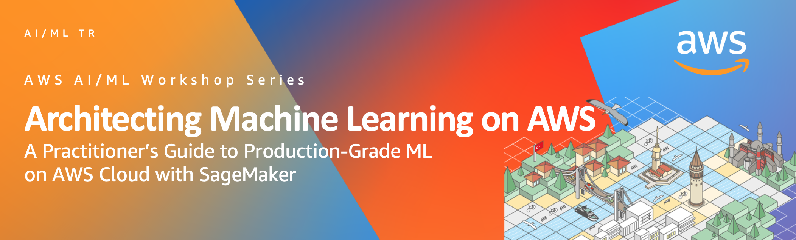

 

# Architecting Machine Learning on AWS
Architecting Machine Learning on AWS: A Practitioner’s Guide to Production-Grade ML on AWS Cloud with SageMaker

`(Revision History:
PA2, 2021-11-01, @akirmak: Q4 Dry-run updates
`
*Welcome to the Architecting Machine Learning on AWS using SageMaker workshop.*

## Overview

The objective of this workshop is to provide a practitioner's guide to challenges of real-world ML problems, and demonstrate examples of how to tackle them on AWS Cloud. 

There is abundance of online training (online training in Coursera, Data Camp, O'Reilly Online, A Cloud Guru, Udemy), books & articles (medium, blog posts) and code (For AWS SageMaker only, there are hundreds of Sample Notebooks from every imaginable use case, ML domain). So how is this workshop different? We aim to bring together theory & practice for an architectural perspective.

Areas covered: 

- **Data Preparation:** You will explore various examples of  Data Exploration, Feature Engineering & Data Cleaning using popular frameworks on python using a Jupyter Notebook.  
    
- **ML Training**: You will train a supervised learning algorithm for classification. 

- **Evaluating ML Models:** The key to evaluating performance of an ML model is to be able to generate various metrics (depending on the type of algorithm), and to be able to persist measurements in the ML Project Life Cycle. You will see how model metrics, and metrics related to the compute cluster are persisted in Amazon S3 and AWS CloudWatch.  

- **Optimizing ML Models**: ML Optimization is a stochastic process. You will experiment with Automated Hyperparameter Tuning using Bayesian Search strategy to find the best performing hyperparameters. 

- **Framing the ML Problem:**  Infrastructure Requirements & Business Context

## Prerequisites

### Audience

- **Python** – you don't need to be an expert python programmer, but you do need to know the basics. If you don't, the official [Python tutorial](https://docs.python.org/3/tutorial/) is a good place to start.

### Implicit Info & Level 300
This material is not a self-service document (yet). A lot of the key messages, that will be given in the session are not reflected in the document yet and will be articulated by the AWS presenter. Later revisions will improve.

This material is a Level 200 document. It assumes basic experince on AWS (AWS Console, S3, IAM). 

### Tools, Services
- **AWS Account**: Bring your own AWS Account (with admin access to S3, SageMaker, IAM, ECR, Comprehend, Athena). Or ask the AWS team to provide temporary accounts. 

## Preparing for the Labs
#### AWS Provided Temporary Accounts 

As described here, login to your AWS Console and to SageMaker Studio  https://sagemaker-immersionday.workshop.aws/en/prerequisites/option1.html 
       
#### Bring Your Own Account
As described here, login to SageMaker Studio: https://sagemaker-immersionday.workshop.aws/en/prerequisites/option2.html

#### Download Lab Guides & SageMaker Sample Notebooks (in SageMaker)

    - Open SageMaker Terminal
    - Clone SageMaker examples `git clone https://github.com/CloudaYolla/aws-architecting-ML-sagemaker.git`

### 10. Cleaning up resources 

**Very Important:** SageMaker Studio Notebook Kernels run on EC2, and therefore you will be billed by the second unless you save your work (by downloading to your local computer) & terminate the SageMaker Studio instance. 

 Thank you.

