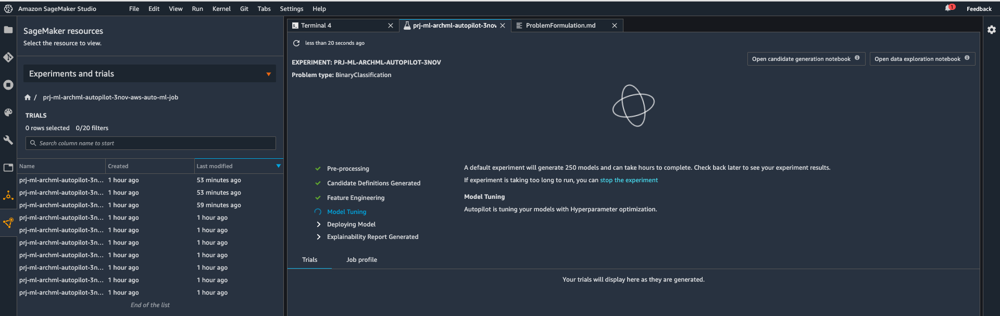
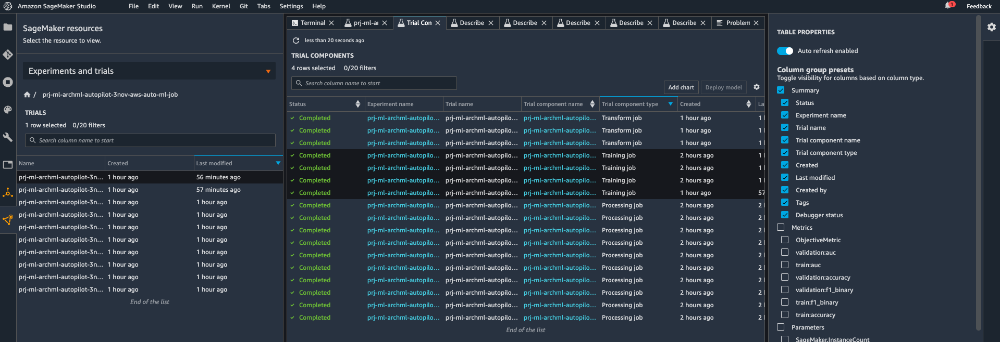
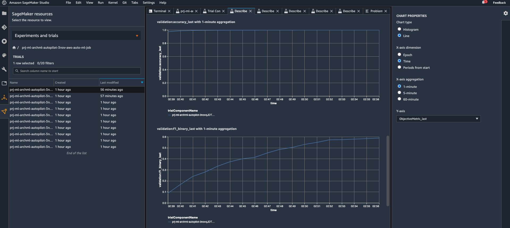

# Using SageMaker AutoPilot to Solve the Banking Fraud Problem
Consider Using AutoPilot to Predict the Banking Fraud Use case

## How does AutoPilot fit into the picture? 

Assume that you are hungry. You have 3 options. 
- First is to call your favorite restaurant and order food. This corresponds to the AI Services stack on AWS (e.g. using Textract service to do AI based OCR, or using Comprehend to do sentiment analysis).
- Second option is to go to kitchen, and cook your food using a favorite receipe from your grandma. That is what AutoPilot does for you.
- Third option is to go to kitchen and cook your own food using your own receipe. That is what we will see with Amazon SageMaker. 

## How to use AutoPilot

- Identify the column you'd like to predict.
- Upload your dataset to S3. 
- Follow the instructions below
  -   Use this one if you prefer the AWS SageMaker Studio console (GUI): https://aws.amazon.com/getting-started/hands-on/create-machine-learning-model-automatically-sagemaker-autopilot/# 
  -   Follow the instructions here if you prefer to do it from a Juputer Notebook using the SDK: https://sagemaker-examples.readthedocs.io/en/latest/autopilot/autopilot_customer_churn.html

## AutoPilot Results

AutoPilot tries out hundreds of scenarios automatically for you.

 

All metadata related to the ML project (input/output paths, hyperparameters, objective metrics, artifact locations etc.) are recorded into SageMaker Model Registry

 

You could evaluate results and compare executions using charts. 

 

