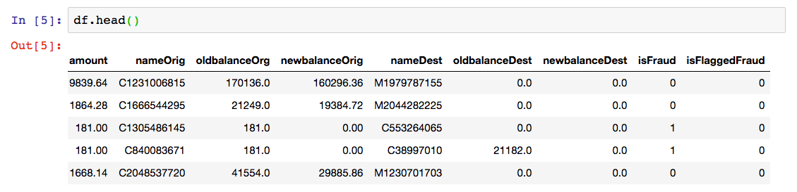

# Banking Fraud
Every year, billions of banking transactions occur in the United States. While only a small portion of those are fraudulent, the results can be devastating is a fraudulent transaction is not discovered. Costs include damage to the customer, to the company, and to regulator agencies tasked with confirming validity of payments. 

## Fraud Detection 
Today, your task is to design a system capable of automatically catching fraudulent transactions. You will have a variety of approaches to evaluate. You will have labeled data, so you can design a classification approach. Your challenge will be finding the right model, or combinations of models, that detect the most fraudulent transactions. 

## Your Data

**DataSet: Synthetic Financial Datasets For Fraud Detection: Synthetic datasets generated by the PaySim mobile money simulator**

Create a Kaggle account and download your data from this location:
* https://www.kaggle.com/ealaxi/paysim1

Alternatively, for the AWS workshop use the following command (exact path will be provided during the workshop)

* `aws s3 cp s3://[bucket-name]/archml-dataset-paysim1/PS_20174392719_1491204439457_log.csv .`

You will have 470+ MB of records, just over 6 million records with 11 columns. This data set is a simulation, designed to accelerate research for financial applications. Each record is a single transaction, marked as cash in, cash out, debit, credit, or transfer. Each transaction will also have the amount, the name of origin, etc.  Interestingly enough you'll have 2 target columns. One appears to be an indicator isFraud, which should be a manual label. Another is a flag based on a rule applied, that is, when a transaction has been attempted for over 200,000. 

Explore both columns. It is very common for companies in finance to be currently using a rules-based system, and exploring the move from a large and complex rules-engine towards a dynamically learning and scalable machine-driven system.

## Classifiers
The data come provided to you in a single file. You will need to split them into a train, test, and validation set. Use the validation set extensively when optimizing your model, but rely on the test set only sparingly to determine the final evaluation report on your model.

For your first approach, use the XGBoost algorithm built-into SageMaker.

## Feature Engineering
For your feature engineering, consider the following stpes:
- Perform one hot encoding to convert the categorical strings into data you can parse in a model
- Use a min-max scaler from sci kit learn to scale the numerical columns 
- Does timestep matter? Can you extract something useful out of it? Is it, or a product of it, correlated with the target variable?

## Starter Code
- https://github.com/awslabs/amazon-sagemaker-examples/blob/master/introduction_to_applying_machine_learning/xgboost_customer_churn/xgboost_customer_churn.ipynb 
    This is a great starter example for beginners! 
- Starter-Code/Multithreaded_Ensemble_Modeling.ipynb
    This is an advanced solution

# References

* Paper introducing your simulated data set
    * https://www.researchgate.net/publication/313138956_PAYSIM_A_FINANCIAL_MOBILE_MONEY_SIMULATOR_FOR_FRAUD_DETECTION/download 

